# Additional Use Case Diagrams - Akudihatinya Backend

Dokumen ini berisi use case diagram untuk fitur-fitur utama dalam sistem Akudihatinya Backend selain Account/User management.

## 1. Patient Management Use Case Diagram

```mermaid
graph TB
    %% Actors
    PU[👤 Puskesmas User]
    A[👨‍💼 Admin]
    S[🤖 System]
    
    %% Patient Management System
    subgraph PMSystem["📋 Patient Management System"]
        %% Core Use Cases
        UC1["📝 Create Patient"]
        UC2["👁️ View Patient List"]
        UC3["✏️ Edit Patient"]
        UC4["🗑️ Delete Patient"]
        UC5["🔍 Search Patient"]
        UC6["📊 Export Patient Data"]
        UC7["📋 Add Examination Year"]
        UC8["❌ Remove Examination Year"]
        
        %% Extended Use Cases
        UC9["📄 Export to Excel"]
        UC10["📑 Export to PDF"]
        UC11["🔍 Filter by Disease Type"]
        UC12["📱 Validate Phone Number"]
    end
    
    %% Relationships
    PU --> UC1
    PU --> UC2
    PU --> UC3
    PU --> UC4
    PU --> UC5
    PU --> UC6
    PU --> UC7
    PU --> UC8
    
    A --> UC2
    A --> UC5
    A --> UC6
    
    %% Include relationships
    UC6 -.->|include| UC9
    UC6 -.->|include| UC10
    UC2 -.->|include| UC11
    UC5 -.->|include| UC11
    UC1 -.->|include| UC12
    UC3 -.->|include| UC12
    
    %% System relationships
    S --> UC12
    
    %% Styling
    classDef actor fill:#e1f5fe,stroke:#01579b,stroke-width:2px
    classDef usecase fill:#f3e5f5,stroke:#4a148c,stroke-width:2px
    classDef system fill:#e8f5e8,stroke:#1b5e20,stroke-width:2px
    classDef include fill:#fff3e0,stroke:#e65100,stroke-width:2px
    
    class PU,A,S actor
    class UC1,UC2,UC3,UC4,UC5,UC6,UC7,UC8 usecase
    class UC9,UC10,UC11,UC12 include
```

## 2. Examination Management Use Case Diagram

```mermaid
graph TB
    %% Actors
    PU[👤 Puskesmas User]
    A[👨‍💼 Admin]
    S[🤖 System]
    
    %% Examination Management System
    subgraph EMSystem["🩺 Examination Management System"]
        %% HT Examination Use Cases
        UC13["🩺 Create HT Examination"]
        UC14["📋 View HT Examinations"]
        UC15["✏️ Edit HT Examination"]
        UC16["🗑️ Delete HT Examination"]
        
        %% DM Examination Use Cases
        UC17["💉 Create DM Examination"]
        UC18["📋 View DM Examinations"]
        UC19["✏️ Edit DM Examination"]
        UC20["🗑️ Delete DM Examination"]
        UC21["📦 Batch Update DM"]
        
        %% Common Use Cases
        UC22["🔍 Filter by Date"]
        UC23["🔍 Filter by Patient"]
        UC24["📊 Filter by Archive Status"]
        UC25["📅 Validate Examination Date"]
        UC26["🏥 Validate Puskesmas Access"]
        UC27["📋 Auto-populate Patient Data"]
    end
    
    %% Relationships
    PU --> UC13
    PU --> UC14
    PU --> UC15
    PU --> UC16
    PU --> UC17
    PU --> UC18
    PU --> UC19
    PU --> UC20
    PU --> UC21
    
    A --> UC14
    A --> UC18
    
    %% Include relationships
    UC13 -.->|include| UC25
    UC13 -.->|include| UC26
    UC13 -.->|include| UC27
    UC15 -.->|include| UC25
    UC15 -.->|include| UC26
    UC17 -.->|include| UC25
    UC17 -.->|include| UC26
    UC17 -.->|include| UC27
    UC19 -.->|include| UC25
    UC19 -.->|include| UC26
    UC21 -.->|include| UC26
    
    UC14 -.->|include| UC22
    UC14 -.->|include| UC23
    UC14 -.->|include| UC24
    UC18 -.->|include| UC22
    UC18 -.->|include| UC23
    UC18 -.->|include| UC24
    
    %% System relationships
    S --> UC25
    S --> UC26
    S --> UC27
    
    %% Styling
    classDef actor fill:#e1f5fe,stroke:#01579b,stroke-width:2px
    classDef usecase fill:#f3e5f5,stroke:#4a148c,stroke-width:2px
    classDef system fill:#e8f5e8,stroke:#1b5e20,stroke-width:2px
    classDef include fill:#fff3e0,stroke:#e65100,stroke-width:2px
    
    class PU,A,S actor
    class UC13,UC14,UC15,UC16,UC17,UC18,UC19,UC20,UC21 usecase
    class UC22,UC23,UC24,UC25,UC26,UC27 include
```

## 3. Statistics & Reports Use Case Diagram

```mermaid
graph TB
    %% Actors
    PU[👤 Puskesmas User]
    A[👨‍💼 Admin]
    S[🤖 System]
    
    %% Statistics & Reports System
    subgraph SRSystem["📊 Statistics & Reports System"]
        %% Core Statistics Use Cases
        UC28["📊 View Dashboard Statistics"]
        UC29["📈 View Admin Statistics"]
        UC30["📋 View General Statistics"]
        UC31["🩺 View HT Statistics"]
        UC32["💉 View DM Statistics"]
        
        %% Export Use Cases
        UC33["📤 Export Statistics"]
        UC34["📄 Export to Excel"]
        UC35["📑 Export to PDF"]
        UC36["📊 Export Quarterly Report"]
        UC37["📈 Export Monthly Report"]
        
        %% Cache & Performance
        UC38["💾 Cache Monthly Statistics"]
        UC39["🔄 Refresh Cache"]
        UC40["⚡ Optimize Query Performance"]
        
        %% Validation & Processing
        UC41["📅 Validate Date Range"]
        UC42["🏥 Validate Puskesmas Access"]
        UC43["📊 Calculate Statistics"]
        UC44["📋 Generate Report Data"]
    end
    
    %% Relationships
    PU --> UC28
    PU --> UC30
    PU --> UC31
    PU --> UC32
    PU --> UC33
    
    A --> UC28
    A --> UC29
    A --> UC30
    A --> UC31
    A --> UC32
    A --> UC33
    
    %% Include relationships
    UC28 -.->|include| UC42
    UC28 -.->|include| UC43
    UC29 -.->|include| UC43
    UC30 -.->|include| UC41
    UC30 -.->|include| UC42
    UC30 -.->|include| UC43
    UC31 -.->|include| UC41
    UC31 -.->|include| UC42
    UC31 -.->|include| UC43
    UC32 -.->|include| UC41
    UC32 -.->|include| UC42
    UC32 -.->|include| UC43
    
    UC33 -.->|include| UC44
    UC33 -.->|include| UC34
    UC33 -.->|include| UC35
    UC34 -.->|include| UC36
    UC34 -.->|include| UC37
    UC35 -.->|include| UC36
    UC35 -.->|include| UC37
    
    %% System relationships
    S --> UC38
    S --> UC39
    S --> UC40
    S --> UC41
    S --> UC42
    S --> UC43
    S --> UC44
    
    %% Extend relationships
    UC38 -.->|extend| UC28
    UC39 -.->|extend| UC29
    UC40 -.->|extend| UC30
    
    %% Styling
    classDef actor fill:#e1f5fe,stroke:#01579b,stroke-width:2px
    classDef usecase fill:#f3e5f5,stroke:#4a148c,stroke-width:2px
    classDef system fill:#e8f5e8,stroke:#1b5e20,stroke-width:2px
    classDef include fill:#fff3e0,stroke:#e65100,stroke-width:2px
    
    class PU,A,S actor
    class UC28,UC29,UC30,UC31,UC32,UC33,UC34,UC35,UC36,UC37 usecase
    class UC38,UC39,UC40,UC41,UC42,UC43,UC44 include
```

## 4. Dashboard Management Use Case Diagram

```mermaid
graph TB
    %% Actors
    PU[👤 Puskesmas User]
    A[👨‍💼 Admin]
    S[🤖 System]
    
    %% Dashboard Management System
    subgraph DMSystem["📊 Dashboard Management System"]
        %% Core Dashboard Use Cases
        UC45["🏥 View Puskesmas Dashboard"]
        UC46["👨‍💼 View Admin Dashboard"]
        UC47["📊 View Real-time Statistics"]
        UC48["📈 View Performance Metrics"]
        UC49["🎯 View Target Progress"]
        
        %% Data Processing
        UC50["📊 Calculate Dashboard Data"]
        UC51["🔄 Refresh Dashboard"]
        UC52["💾 Cache Dashboard Data"]
        UC53["⚡ Optimize Dashboard Performance"]
        
        %% Validation & Security
        UC54["🔐 Validate User Access"]
        UC55["🏥 Filter by Puskesmas"]
        UC56["📅 Filter by Date Range"]
    end
    
    %% Relationships
    PU --> UC45
    PU --> UC47
    PU --> UC48
    PU --> UC49
    
    A --> UC46
    A --> UC47
    A --> UC48
    A --> UC49
    
    %% Include relationships
    UC45 -.->|include| UC54
    UC45 -.->|include| UC55
    UC45 -.->|include| UC50
    UC46 -.->|include| UC54
    UC46 -.->|include| UC50
    UC47 -.->|include| UC54
    UC47 -.->|include| UC56
    UC47 -.->|include| UC50
    UC48 -.->|include| UC54
    UC48 -.->|include| UC50
    UC49 -.->|include| UC54
    UC49 -.->|include| UC50
    
    %% System relationships
    S --> UC50
    S --> UC51
    S --> UC52
    S --> UC53
    S --> UC54
    S --> UC55
    S --> UC56
    
    %% Extend relationships
    UC51 -.->|extend| UC45
    UC51 -.->|extend| UC46
    UC52 -.->|extend| UC47
    UC53 -.->|extend| UC48
    
    %% Styling
    classDef actor fill:#e1f5fe,stroke:#01579b,stroke-width:2px
    classDef usecase fill:#f3e5f5,stroke:#4a148c,stroke-width:2px
    classDef system fill:#e8f5e8,stroke:#1b5e20,stroke-width:2px
    classDef include fill:#fff3e0,stroke:#e65100,stroke-width:2px
    
    class PU,A,S actor
    class UC45,UC46,UC47,UC48,UC49 usecase
    class UC50,UC51,UC52,UC53,UC54,UC55,UC56 include
```

## 5. Yearly Target Management Use Case Diagram

```mermaid
graph TB
    %% Actors
    A[👨‍💼 Admin]
    S[🤖 System]
    
    %% Yearly Target Management System
    subgraph YTSystem["🎯 Yearly Target Management System"]
        %% Core Use Cases
        UC57["🎯 Create Yearly Target"]
        UC58["📋 View Yearly Targets"]
        UC59["✏️ Edit Yearly Target"]
        UC60["🗑️ Delete Yearly Target"]
        UC61["📊 Monitor Target Progress"]
        
        %% Validation & Processing
        UC62["📅 Validate Target Year"]
        UC63["🏥 Validate Puskesmas"]
        UC64["🔢 Validate Target Values"]
        UC65["📊 Calculate Achievement"]
        UC66["📈 Generate Progress Report"]
    end
    
    %% Relationships
    A --> UC57
    A --> UC58
    A --> UC59
    A --> UC60
    A --> UC61
    
    %% Include relationships
    UC57 -.->|include| UC62
    UC57 -.->|include| UC63
    UC57 -.->|include| UC64
    UC59 -.->|include| UC62
    UC59 -.->|include| UC63
    UC59 -.->|include| UC64
    UC61 -.->|include| UC65
    UC61 -.->|include| UC66
    
    %% System relationships
    S --> UC62
    S --> UC63
    S --> UC64
    S --> UC65
    S --> UC66
    
    %% Styling
    classDef actor fill:#e1f5fe,stroke:#01579b,stroke-width:2px
    classDef usecase fill:#f3e5f5,stroke:#4a148c,stroke-width:2px
    classDef system fill:#e8f5e8,stroke:#1b5e20,stroke-width:2px
    classDef include fill:#fff3e0,stroke:#e65100,stroke-width:2px
    
    class A,S actor
    class UC57,UC58,UC59,UC60,UC61 usecase
    class UC62,UC63,UC64,UC65,UC66 include
```

## Use Case Descriptions

### Patient Management Use Cases

#### UC1: Create Patient
- **Actor**: Puskesmas User
- **Description**: Menambahkan data pasien baru ke dalam sistem
- **Precondition**: User sudah login dan memiliki akses Puskesmas
- **Flow**: 
  1. User mengisi form data pasien (NIK, BPJS, nama, alamat, dll)
  2. System memvalidasi nomor telepon
  3. System menyimpan data pasien
- **Postcondition**: Data pasien tersimpan dalam database

#### UC2: View Patient List
- **Actor**: Puskesmas User, Admin
- **Description**: Melihat daftar pasien dengan fitur filter dan pencarian
- **Precondition**: User sudah login
- **Flow**:
  1. User mengakses halaman daftar pasien
  2. System menampilkan daftar pasien sesuai akses user
  3. User dapat memfilter berdasarkan jenis penyakit
- **Postcondition**: Daftar pasien ditampilkan

#### UC6: Export Patient Data
- **Actor**: Puskesmas User, Admin
- **Description**: Mengekspor data pasien ke format Excel atau PDF
- **Precondition**: User sudah login dan ada data pasien
- **Flow**:
  1. User memilih format ekspor (Excel/PDF)
  2. System memproses data pasien
  3. System menghasilkan file ekspor
- **Postcondition**: File ekspor berhasil diunduh

### Examination Management Use Cases

#### UC13: Create HT Examination
- **Actor**: Puskesmas User
- **Description**: Menambahkan data pemeriksaan hipertensi untuk pasien
- **Precondition**: User sudah login, pasien sudah terdaftar
- **Flow**:
  1. User memilih pasien
  2. User mengisi data pemeriksaan HT
  3. System memvalidasi tanggal pemeriksaan
  4. System menyimpan data pemeriksaan
- **Postcondition**: Data pemeriksaan HT tersimpan

#### UC17: Create DM Examination
- **Actor**: Puskesmas User
- **Description**: Menambahkan data pemeriksaan diabetes mellitus untuk pasien
- **Precondition**: User sudah login, pasien sudah terdaftar
- **Flow**:
  1. User memilih pasien
  2. User mengisi data pemeriksaan DM
  3. System memvalidasi tanggal pemeriksaan
  4. System menyimpan data pemeriksaan
- **Postcondition**: Data pemeriksaan DM tersimpan

#### UC21: Batch Update DM
- **Actor**: Puskesmas User
- **Description**: Memperbarui multiple data pemeriksaan DM sekaligus
- **Precondition**: User sudah login, ada data pemeriksaan DM
- **Flow**:
  1. User memilih multiple pemeriksaan DM
  2. User mengubah data yang diperlukan
  3. System memvalidasi akses Puskesmas
  4. System memperbarui semua data terpilih
- **Postcondition**: Multiple data pemeriksaan DM diperbarui

### Statistics & Reports Use Cases

#### UC28: View Dashboard Statistics
- **Actor**: Puskesmas User, Admin
- **Description**: Melihat statistik dashboard sesuai role user
- **Precondition**: User sudah login
- **Flow**:
  1. User mengakses dashboard
  2. System memvalidasi akses user
  3. System menghitung statistik
  4. System menampilkan dashboard
- **Postcondition**: Dashboard statistik ditampilkan

#### UC29: View Admin Statistics
- **Actor**: Admin
- **Description**: Melihat statistik khusus admin (semua Puskesmas)
- **Precondition**: User sudah login sebagai admin
- **Flow**:
  1. Admin mengakses statistik admin
  2. System menghitung statistik semua Puskesmas
  3. System menampilkan statistik komprehensif
- **Postcondition**: Statistik admin ditampilkan

#### UC33: Export Statistics
- **Actor**: Puskesmas User, Admin
- **Description**: Mengekspor data statistik ke berbagai format
- **Precondition**: User sudah login, ada data statistik
- **Flow**:
  1. User memilih jenis dan format ekspor
  2. System menghasilkan data laporan
  3. System membuat file ekspor
  4. User mengunduh file
- **Postcondition**: File statistik berhasil diekspor

### Dashboard Management Use Cases

#### UC45: View Puskesmas Dashboard
- **Actor**: Puskesmas User
- **Description**: Melihat dashboard khusus Puskesmas
- **Precondition**: User sudah login sebagai Puskesmas
- **Flow**:
  1. User mengakses dashboard Puskesmas
  2. System memvalidasi akses user
  3. System memfilter data berdasarkan Puskesmas
  4. System menghitung dan menampilkan data dashboard
- **Postcondition**: Dashboard Puskesmas ditampilkan

#### UC46: View Admin Dashboard
- **Actor**: Admin
- **Description**: Melihat dashboard admin dengan data semua Puskesmas
- **Precondition**: User sudah login sebagai admin
- **Flow**:
  1. Admin mengakses dashboard admin
  2. System memvalidasi akses admin
  3. System menghitung data dari semua Puskesmas
  4. System menampilkan dashboard komprehensif
- **Postcondition**: Dashboard admin ditampilkan

### Yearly Target Management Use Cases

#### UC57: Create Yearly Target
- **Actor**: Admin
- **Description**: Membuat target tahunan untuk Puskesmas
- **Precondition**: User sudah login sebagai admin
- **Flow**:
  1. Admin mengisi form target tahunan
  2. System memvalidasi tahun target
  3. System memvalidasi Puskesmas
  4. System memvalidasi nilai target
  5. System menyimpan target tahunan
- **Postcondition**: Target tahunan tersimpan

#### UC61: Monitor Target Progress
- **Actor**: Admin
- **Description**: Memantau progress pencapaian target tahunan
- **Precondition**: User sudah login sebagai admin, ada target tahunan
- **Flow**:
  1. Admin mengakses monitoring target
  2. System menghitung pencapaian aktual
  3. System membandingkan dengan target
  4. System menghasilkan laporan progress
- **Postcondition**: Progress target ditampilkan

## Use Case Relationships

### Include Relationships
- **Validation**: Semua use case yang melibatkan input data menyertakan validasi
- **Access Control**: Semua use case menyertakan validasi akses user
- **Data Processing**: Use case yang menampilkan data menyertakan pemrosesan data

### Extend Relationships
- **Caching**: Sistem dapat memperluas use case dengan caching untuk performa
- **Optimization**: Sistem dapat memperluas use case dengan optimasi query
- **Refresh**: Sistem dapat memperluas use case dengan refresh data

### Generalization
- **Export Functions**: Export Excel dan PDF adalah spesialisasi dari Export Statistics
- **Examination Management**: HT dan DM examination menggunakan pola yang sama
- **Dashboard Views**: Puskesmas dan Admin dashboard menggunakan struktur yang sama

## Business Rules

### Role-based Access Control
- Admin dapat mengakses semua fitur dan data semua Puskesmas
- Puskesmas User hanya dapat mengakses data Puskesmas mereka sendiri
- System melakukan validasi akses pada setiap operasi

### Data Validation
- Semua input data harus divalidasi sebelum disimpan
- Tanggal pemeriksaan tidak boleh di masa depan
- NIK dan BPJS harus unik dalam sistem
- Nomor telepon harus dalam format yang valid

### Performance Optimization
- Sistem menggunakan caching untuk data statistik yang sering diakses
- Query database dioptimasi dengan indexing
- Data lama dapat diarsipkan untuk meningkatkan performa

### Security
- Semua endpoint dilindungi dengan autentikasi
- Data sensitif dienkripsi
- Audit trail dicatat untuk semua operasi penting

### Export & Reporting
- Export data dibatasi sesuai akses user
- Format export mendukung Excel dan PDF
- Laporan dapat difilter berdasarkan periode waktu
- Sistem mendukung export batch untuk data besar