# 🔄 Data Flow Diagram

Dokumen ini berisi Data Flow Diagram untuk sistem Akudihatinya Backend yang menunjukkan aliran data dalam sistem.

## Context Diagram (Level 0)

```mermaid
flowchart TB
    subgraph "External Entities"
        Admin[👤 Admin]
        PuskesmasUser[👤 User Puskesmas]
        System[🖥️ System Scheduler]
    end

    subgraph "Akudihatinya System"
        AkudihatinyaSystem[Sistem Akudihatinya Backend]
    end

    subgraph "Data Stores"
        UserDB[(User Database)]
        PatientDB[(Patient Database)]
        ExaminationDB[(Examination Database)]
        StatisticsDB[(Statistics Database)]
        ReportFiles[Report Files]
    end

    %% Admin flows
    Admin -->|Login Credentials| AkudihatinyaSystem
    AkudihatinyaSystem -->|Authentication Token| Admin
    Admin -->|Puskesmas Data| AkudihatinyaSystem
    AkudihatinyaSystem -->|Puskesmas List| Admin
    Admin -->|User Management Data| AkudihatinyaSystem
    AkudihatinyaSystem -->|User List| Admin
    Admin -->|Target Data| AkudihatinyaSystem
    AkudihatinyaSystem -->|Global Statistics| Admin
    AkudihatinyaSystem -->|Global Reports| Admin

    %% Puskesmas User flows
    PuskesmasUser -->|Login Credentials| AkudihatinyaSystem
    AkudihatinyaSystem -->|Authentication Token| PuskesmasUser
    PuskesmasUser -->|Patient Data| AkudihatinyaSystem
    AkudihatinyaSystem -->|Patient List| PuskesmasUser
    PuskesmasUser -->|Examination Data| AkudihatinyaSystem
    AkudihatinyaSystem -->|Examination Results| PuskesmasUser
    AkudihatinyaSystem -->|Puskesmas Statistics| PuskesmasUser
    AkudihatinyaSystem -->|Puskesmas Reports| PuskesmasUser

    %% System flows
    System -->|Schedule Trigger| AkudihatinyaSystem
    AkudihatinyaSystem -->|Automated Reports| System
    AkudihatinyaSystem -->|Backup Data| System

    %% Data store connections
    AkudihatinyaSystem <--> UserDB
    AkudihatinyaSystem <--> PatientDB
    AkudihatinyaSystem <--> ExaminationDB
    AkudihatinyaSystem <--> StatisticsDB
    AkudihatinyaSystem <--> ReportFiles
```

## Level 1 DFD - System Decomposition

```mermaid
flowchart TB
    subgraph "External Entities"
        Admin[👤 Admin]
        PuskesmasUser[👤 User Puskesmas]
        System[🖥️ System]
    end

    subgraph "Main Processes"
        P1[1.0 Authentication & Authorization]
        P2[2.0 User Management]
        P3[3.0 Puskesmas Management]
        P4[4.0 Patient Management]
        P5[5.0 Examination Management]
        P6[6.0 Statistics Processing]
        P7[7.0 Report Generation]
        P8[8.0 System Administration]
    end

    subgraph "Data Stores"
        D1[(D1: Users)]
        D2[(D2: Puskesmas)]
        D3[(D3: Patients)]
        D4[(D4: HT Examinations)]
        D5[(D5: DM Examinations)]
        D6[(D6: Yearly Targets)]
        D7[(D7: Statistics Cache)]
        D8[(D8: Reports)]
    end

    %% Admin flows
    Admin -->|Login Request| P1
    P1 -->|Auth Token| Admin
    Admin -->|User Data| P2
    P2 -->|User List| Admin
    Admin -->|Puskesmas Data| P3
    P3 -->|Puskesmas List| Admin
    Admin -->|Target Data| P8
    Admin -->|Statistics Request| P6
    P6 -->|Global Statistics| Admin
    Admin -->|Report Request| P7
    P7 -->|Global Reports| Admin

    %% Puskesmas User flows
    PuskesmasUser -->|Login Request| P1
    P1 -->|Auth Token| PuskesmasUser
    PuskesmasUser -->|Patient Data| P4
    P4 -->|Patient List| PuskesmasUser
    PuskesmasUser -->|Examination Data| P5
    P5 -->|Examination Results| PuskesmasUser
    PuskesmasUser -->|Statistics Request| P6
    P6 -->|Puskesmas Statistics| PuskesmasUser
    PuskesmasUser -->|Report Request| P7
    P7 -->|Puskesmas Reports| PuskesmasUser

    %% System flows
    System -->|Schedule Trigger| P6
    System -->|Backup Trigger| P8
    P8 -->|Backup Status| System

    %% Process to Data Store flows
    P1 <--> D1
    P2 <--> D1
    P3 <--> D2
    P4 <--> D3
    P4 <--> D2
    P5 <--> D4
    P5 <--> D5
    P5 <--> D3
    P6 <--> D4
    P6 <--> D5
    P6 <--> D7
    P7 <--> D8
    P8 <--> D6
```

## Level 2 DFD - Examination Management Detail

```mermaid
flowchart TB
    subgraph "External Entities"
        PuskesmasUser[👤 User Puskesmas]
    end

    subgraph "Examination Management Processes"
        P51[5.1 Validate Examination Data]
        P52[5.2 Record HT Examination]
        P53[5.3 Record DM Examination]
        P54[5.4 Calculate Control Status]
        P55[5.5 Update Statistics]
        P56[5.6 Archive Examinations]
    end

    subgraph "Data Stores"
        D3[(D3: Patients)]
        D4[(D4: HT Examinations)]
        D5[(D5: DM Examinations)]
        D7[(D7: Statistics Cache)]
    end

    %% Input flows
    PuskesmasUser -->|HT Examination Data| P51
    PuskesmasUser -->|DM Examination Data| P51
    PuskesmasUser -->|Archive Request| P56

    %% Process flows
    P51 -->|Valid HT Data| P52
    P51 -->|Valid DM Data| P53
    P51 -->|Invalid Data| PuskesmasUser
    
    P52 -->|HT Record| P54
    P53 -->|DM Record| P54
    
    P54 -->|Control Status| P55
    P55 -->|Updated Statistics| PuskesmasUser
    
    P56 -->|Archive Status| PuskesmasUser

    %% Data store interactions
    P51 <--> D3
    P52 <--> D4
    P53 <--> D5
    P54 <--> D4
    P54 <--> D5
    P55 <--> D7
    P56 <--> D4
    P56 <--> D5
```

## Level 2 DFD - Statistics Processing Detail

```mermaid
flowchart TB
    subgraph "External Entities"
        Admin[👤 Admin]
        PuskesmasUser[👤 User Puskesmas]
        System[🖥️ System]
    end

    subgraph "Statistics Processing"
        P61[6.1 Calculate HT Statistics]
        P62[6.2 Calculate DM Statistics]
        P63[6.3 Aggregate Global Statistics]
        P64[6.4 Update Cache]
        P65[6.5 Generate Monthly Statistics]
    end

    subgraph "Data Stores"
        D2[(D2: Puskesmas)]
        D4[(D4: HT Examinations)]
        D5[(D5: DM Examinations)]
        D6[(D6: Yearly Targets)]
        D7[(D7: Statistics Cache)]
    end

    %% Input flows
    Admin -->|Global Stats Request| P63
    PuskesmasUser -->|Puskesmas Stats Request| P61
    PuskesmasUser -->|Puskesmas Stats Request| P62
    System -->|Monthly Schedule| P65

    %% Process flows
    P61 -->|HT Statistics| P64
    P62 -->|DM Statistics| P64
    P63 -->|Global Statistics| Admin
    P64 -->|Cached Data| P61
    P64 -->|Cached Data| P62
    P65 -->|Monthly Stats| P64

    %% Output flows
    P61 -->|HT Statistics| PuskesmasUser
    P62 -->|DM Statistics| PuskesmasUser

    %% Data store interactions
    P61 <--> D4
    P61 <--> D2
    P62 <--> D5
    P62 <--> D2
    P63 <--> D4
    P63 <--> D5
    P63 <--> D6
    P64 <--> D7
    P65 <--> D4
    P65 <--> D5
```

## Level 2 DFD - Report Generation Detail

## Data Dictionary

### Data Flows

| Data Flow | Description | Composition |
|-----------|-------------|-------------|
| Login Credentials | User authentication data | username + password |
| Authentication Token | JWT token for API access | access_token + refresh_token + expires_in |
| Patient Data | Patient information | nik + name + address + phone + gender + birth_date + ht_years + dm_years |
| Examination Data | Medical examination results | patient_id + examination_date + type + results |
| HT Examination Data | Hypertension examination | systolic + diastolic + examination_date |
| DM Examination Data | Diabetes examination | examination_type + result + examination_date |
| Statistics Request | Request for statistical data | puskesmas_id + year + month + disease_type |
| Report Request | Request for report generation | format + period + filters + puskesmas_id |
| Global Statistics | Aggregated system statistics | total_patients + controlled_patients + percentage + trends |
| Puskesmas Statistics | Individual puskesmas stats | patient_count + examination_count + control_rate |

### Data Stores

| Data Store | Description | Key Fields |
|------------|-------------|------------|
| D1: Users | System users | id, username, password, role, puskesmas_id |
| D2: Puskesmas | Health centers | id, name, address, phone, email, is_active |
| D3: Patients | Patient records | id, nik, name, puskesmas_id, ht_years, dm_years |
| D4: HT Examinations | Hypertension examinations | id, patient_id, systolic, diastolic, examination_date |
| D5: DM Examinations | Diabetes examinations | id, patient_id, examination_type, result, examination_date |
| D6: Yearly Targets | Annual targets | id, puskesmas_id, disease_type, year, target_count |
| D7: Statistics Cache | Cached statistical data | id, puskesmas_id, disease_type, year, month, data |
| D8: Reports | Generated report files | id, filename, path, type, created_at |

### Processes

| Process | Description | Inputs | Outputs |
|---------|-------------|--------|----------|
| 1.0 Authentication & Authorization | Handle user login/logout | Login credentials | Auth tokens |
| 2.0 User Management | Manage system users | User data | User list |
| 3.0 Puskesmas Management | Manage health centers | Puskesmas data | Puskesmas list |
| 4.0 Patient Management | Manage patient records | Patient data | Patient list |
| 5.0 Examination Management | Handle medical examinations | Examination data | Examination results |
| 6.0 Statistics Processing | Calculate and cache statistics | Raw examination data | Statistical reports |
| 7.0 Report Generation | Generate PDF/Excel reports | Report parameters | Report files |
| 8.0 System Administration | System maintenance tasks | Admin commands | System status |

## Data Flow Rules

### Business Rules
1. **Authentication Required**: All data flows require valid authentication tokens
2. **Role-based Access**: Admin can access all data, Puskesmas users only their own data
3. **Data Validation**: All input data must pass validation before processing
4. **Audit Trail**: All data modifications are logged with timestamps
5. **Cache Invalidation**: Statistics cache is updated when examination data changes

### Technical Rules
1. **Data Integrity**: Foreign key constraints ensure referential integrity
2. **Concurrency Control**: Optimistic locking prevents data conflicts
3. **Performance Optimization**: Frequently accessed data is cached
4. **Backup Strategy**: Critical data flows trigger backup processes
5. **Error Handling**: Failed processes return appropriate error messages

### Security Rules
1. **Data Encryption**: Sensitive data is encrypted in transit and at rest
2. **Input Sanitization**: All inputs are sanitized to prevent injection attacks
3. **Rate Limiting**: API calls are rate-limited to prevent abuse
4. **Access Logging**: All data access is logged for security auditing
5. **Token Expiration**: Authentication tokens have limited lifespans