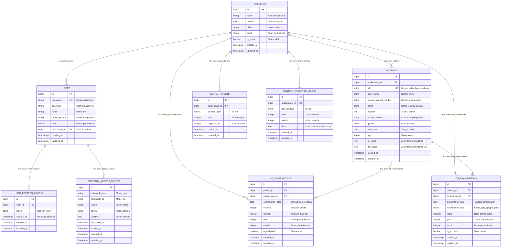

# Entity Relationship Diagram (ERD)

Dokumen ini berisi Entity Relationship Diagram lengkap untuk sistem Akudihatinya Backend.

## ERD Diagram

## Penjelasan Detail Entitas

### 1. USERS
**Deskripsi:** Tabel pengguna sistem yang mencakup admin dan pengguna puskesmas.

**Atribut Utama:**
- `role`: Menentukan level akses (admin dapat mengakses semua data, puskesmas hanya data sendiri)
- `puskesmas_id`: NULL untuk admin, berisi ID puskesmas untuk user puskesmas
- `username`: Unique identifier untuk login

**Relasi:**
- Belongs to PUSKESMAS (untuk user dengan role puskesmas)
- Has many USER_REFRESH_TOKENS
- Has many PERSONAL_ACCESS_TOKENS

### 2. PUSKESMAS
**Deskripsi:** Master data puskesmas yang menjadi pusat dari hampir semua entitas lain.

**Atribut Utama:**
- `is_active`: Flag untuk mengaktifkan/menonaktifkan puskesmas
- `name`: Nama resmi puskesmas

**Relasi:**
- Has many USERS
- Has many PATIENTS
- Has many HT_EXAMINATIONS
- Has many DM_EXAMINATIONS
- Has many YEARLY_TARGETS
- Has many MONTHLY_STATISTICS_CACHE

### 3. PATIENTS
**Deskripsi:** Data pasien yang terdaftar di puskesmas.

**Atribut Utama:**
- `nik`: Nomor Induk Kependudukan sebagai unique identifier
- `ht_years`: Array JSON berisi tahun-tahun pasien menderita hipertensi
- `dm_years`: Array JSON berisi tahun-tahun pasien menderita diabetes
- `medical_record_number`: Nomor rekam medis internal puskesmas

**Relasi:**
- Belongs to PUSKESMAS
- Has many HT_EXAMINATIONS
- Has many DM_EXAMINATIONS

### 4. HT_EXAMINATIONS
**Deskripsi:** Data pemeriksaan hipertensi pasien.

**Atribut Utama:**
- `systolic`: Tekanan darah sistolik
- `diastolic`: Tekanan darah diastolik
- `is_archived`: Flag untuk arsip data lama

**Business Logic:**
- Tekanan terkendali: sistolik 90-139 dan diastolik 60-89

**Relasi:**
- Belongs to PATIENT
- Belongs to PUSKESMAS

### 5. DM_EXAMINATIONS
**Deskripsi:** Data pemeriksaan diabetes mellitus pasien.

**Atribut Utama:**
- `examination_type`: Jenis pemeriksaan (HbA1c, GDP, GD2JPP, GDSP)
- `result`: Hasil pemeriksaan dalam bentuk decimal
- `is_archived`: Flag untuk arsip data lama

**Business Logic:**
- Kontrol berdasarkan jenis:
  - HbA1c: terkendali jika < 7
  - GDP: terkendali jika < 126
  - GD2JPP: terkendali jika < 200
  - GDSP: tidak dihitung untuk kontrol

**Relasi:**
- Belongs to PATIENT
- Belongs to PUSKESMAS

### 6. YEARLY_TARGETS
**Deskripsi:** Target tahunan untuk setiap puskesmas per jenis penyakit.

**Atribut Utama:**
- `disease_type`: Jenis penyakit (ht/dm)
- `target_count`: Jumlah target yang harus dicapai

**Relasi:**
- Belongs to PUSKESMAS

### 7. USER_REFRESH_TOKENS
**Deskripsi:** Token refresh untuk sistem autentikasi.

**Atribut Utama:**
- `token`: Refresh token string
- `expires_at`: Waktu kadaluarsa token

**Relasi:**
- Belongs to USER

### 8. MONTHLY_STATISTICS_CACHE
**Deskripsi:** Cache untuk statistik bulanan guna meningkatkan performa.

**Atribut Utama:**
- `data`: Data statistik dalam format JSON
- `disease_type`: Jenis penyakit untuk statistik

**Relasi:**
- Belongs to PUSKESMAS

### 9. PERSONAL_ACCESS_TOKENS
**Deskripsi:** Token akses personal untuk API authentication (Laravel Sanctum).

**Atribut Utama:**
- `tokenable_type`: Tipe model (biasanya User)
- `tokenable_id`: ID dari model
- `abilities`: Kemampuan yang dimiliki token

**Relasi:**
- Polymorphic relationship dengan USERS

## Indeks dan Constraint

### Primary Keys
- Semua tabel menggunakan `id` sebagai primary key dengan tipe `bigint`

### Foreign Keys
- `users.puskesmas_id` → `puskesmas.id`
- `patients.puskesmas_id` → `puskesmas.id`
- `ht_examinations.patient_id` → `patients.id`
- `ht_examinations.puskesmas_id` → `puskesmas.id`
- `dm_examinations.patient_id` → `patients.id`
- `dm_examinations.puskesmas_id` → `puskesmas.id`
- `yearly_targets.puskesmas_id` → `puskesmas.id`
- `user_refresh_tokens.user_id` → `users.id`
- `monthly_statistics_cache.puskesmas_id` → `puskesmas.id`

### Unique Constraints
- `users.username`
- `patients.nik`

### Performance Indexes
- Index pada `examination_date` untuk tabel pemeriksaan
- Index pada `year` dan `month` untuk filtering temporal
- Index pada `puskesmas_id` untuk filtering berdasarkan puskesmas
- Composite index pada `(puskesmas_id, year, month)` untuk statistik

## Catatan Implementasi

1. **Soft Deletes**: Tidak digunakan, sebagai gantinya menggunakan `is_archived` untuk data pemeriksaan
2. **JSON Fields**: Digunakan untuk `ht_years`, `dm_years`, dan `data` statistik
3. **Enum Values**: Didefinisikan di level aplikasi untuk konsistensi
4. **Timestamps**: Semua tabel menggunakan `created_at` dan `updated_at`
5. **Caching**: Implementasi cache pada level aplikasi untuk statistik bulanan