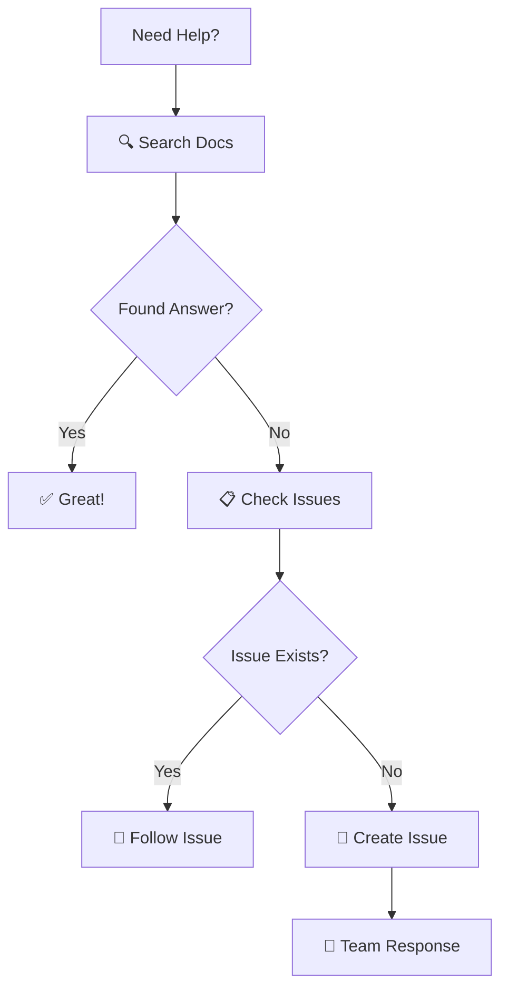

<div align="center">

# 🏥 Akudihatinya Backend Documentation

<p align="center">
  
  
  
  
</p>

<h3>🩺 Sistem Monitoring Kesehatan Puskesmas</h3>
<p><em>Dokumentasi lengkap untuk pengembangan, deployment, dan penggunaan sistem</em></p>

<p>
  <a href="#-quick-start">Quick Start</a> •
  <a href="#-api-reference">API Reference</a> •
  <a href="#-architecture">Architecture</a> •
  <a href="#-contributing">Contributing</a>
</p>

</div>

---

## 📋 Table of Contents

<details>
<summary><strong>🚀 Quick Start</strong></summary>

| 📖 Document | 📝 Description | 🎯 Status |
|-------------|----------------|------------|
| [**👨‍💻 Developer Guide**](./DEVELOPER_GUIDE.md) | Complete development, deployment & contribution guide |  |
| [**📚 API Reference**](./API_REFERENCE.md) | Complete API endpoints & documentation |  |

</details>

<details>
<summary><strong>🏗️ System Architecture & Design</strong></summary>

| 📖 Document | 📝 Description | 🎯 Status |
|-------------|----------------|------------|
| [**🏗️ System Architecture**](./SYSTEM_ARCHITECTURE.md) | Complete system design: ERD, use cases, diagrams & data flow |  |

</details>

<details>
<summary><strong>🔧 Features & Implementation</strong></summary>

| 📖 Document | 📝 Description | 🎯 Status |
|-------------|----------------|------------|
| [**📋 API Reference**](./API_REFERENCE.md) | Complete API documentation with all features |  |
| [**📋 Dashboard Structure**](./DASHBOARD_PUSKESMAS_STRUCTURE.md) | Dashboard response structure & metadata |  |
| [**🔧 Dashboard API Fixes**](./DASHBOARD_API_FIXES.md) | Dashboard API statistics fixes |  |

</details>

<details>
<summary><strong>📊 Best Practices & Guidelines</strong></summary>

| 📖 Document | 📝 Description | 🎯 Status |
|-------------|----------------|------------|
| [**🎯 New Year Setup**](./NEW_YEAR_SETUP.md) | Annual data reset and target creation |  |
| [**⚡ Code Quality Insights**](./CODE_QUALITY_INSIGHTS.md) | Code quality recommendations |  |

</details>

<details>
<summary><strong>📝 Project Management</strong></summary>

| 📖 Document | 📝 Description | 🎯 Status |
|-------------|----------------|------------|
| [**📋 Changelog**](./CHANGELOG.md) | Project version history & changes |  |

</details>

## 📁 Documentation Structure

```
docs/
├── README.md                           # 📋 Documentation index
├── 
├── 🚀 Core Documentation
├── ├── DEVELOPER_GUIDE.md              # Complete development & deployment guide
├── ├── API_REFERENCE.md                # Complete API endpoints reference
├── ├── SYSTEM_ARCHITECTURE.md          # Complete system design & diagrams
├── └── NEW_YEAR_SETUP.md               # New year automation setup
├── 
├── 🔧 Features & Implementation
├── ├── PATIENT_MANAGEMENT.md           # Patient management features
├── ├── EXAMINATION_MANAGEMENT.md       # Examination management
├── ├── STATISTICS_MANAGEMENT.md        # Statistics & reporting
├── ├── USER_MANAGEMENT.md              # User & role management
├── ├── PUSKESMAS_MANAGEMENT.md         # Puskesmas management
├── ├── YEARLY_TARGET_MANAGEMENT.md     # Yearly targets management
├── ├── MONTHLY_STATISTICS.md           # Monthly statistics
├── ├── YEARLY_STATISTICS.md            # Yearly statistics
├── ├── DASHBOARD_ADMIN.md              # Admin dashboard
├── └── DASHBOARD_PUSKESMAS.md          # Puskesmas dashboard
├── 
├── 📊 Best Practices & Guidelines
├── ├── NEW_YEAR_SETUP.md               # Annual setup guide
├── └── CODE_QUALITY_INSIGHTS.md        # Code quality recommendations
├── 
└── 📝 Project Management
    └── CHANGELOG.md                    # Version history & changes
## 🚀 Quick Start

<div align="center">

### Choose Your Path

</div>

<table>
<tr>
<td width="33%">

#### 👨‍💻 **Developers**
```bash
# Quick Setup
git clone <repository>
composer install
php artisan serve
```

**Essential Docs:**
- 🛠️ [Development Guide](DEVELOPMENT_GUIDE.md)
- 📚 [API Documentation](API_DOCUMENTATION.md) 
- 🗄️ [Database ERD](ERD.md)

</td>
<td width="33%">

#### 🔧 **System Admins**
```bash
# Production Deploy
docker-compose up -d
php artisan migrate
php artisan optimize
```

**Essential Docs:**
- 🚀 [Deployment Guide](DEPLOYMENT_GUIDE.md)
- 🏛️ [System Architecture](SYSTEM_DIAGRAMS.md)
- 📊 [API Reference](API_REFERENCE.md)

</td>
<td width="33%">

#### 📊 **Project Managers**
```text
# Understanding System
✓ Review use cases
✓ Check data flows  
✓ Monitor progress
```

**Essential Docs:**
- 👥 [Use Cases](USE_CASE_DIAGRAM.md)
- 🔄 [Data Flow](DATA_FLOW_DIAGRAM.md)
- 📋 [Project Status](CHANGELOG.md)

</td>
</tr>
</table>

---

## 📝 Documentation Standards

<div align="center">

### 🎯 Our Documentation Philosophy
*"Great documentation is code that teaches itself"*

</div>

<table>
<tr>
<td width="50%">

#### ✅ **Writing Guidelines**

```markdown
📝 Clear & Concise
   └── Use simple, direct language
   └── Avoid technical jargon
   └── Write for your audience

💡 Code Examples
   └── Include practical examples
   └── Show real-world usage
   └── Test all code snippets

🔄 Consistent Format
   └── Follow established patterns
   └── Use standard templates
   └── Maintain visual consistency

🔄 Keep Updated
   └── Sync with code changes
   └── Review quarterly
   └── Version control docs
```

</td>
<td width="50%">

#### 📁 **File Conventions**

```markdown
📂 Naming Convention
   └── UPPERCASE_WITH_UNDERSCORES.md
   └── Descriptive, not cryptic
   └── Group related docs

🏗️ Document Structure
   ├── 📋 Title & Description
   ├── 📑 Table of Contents
   ├── 📖 Main Content
   ├── 💡 Examples & Usage
   └── 🔗 References & Links

🔗 Linking Standards
   └── Use relative paths
   └── Test all links
   └── Provide context
```

</td>
</tr>
</table>

---

## 🔄 Maintenance & Support

<div align="center">

### 🛠️ Keeping Documentation Fresh & Helpful

</div>

<table>
<tr>
<td width="50%">

#### 📅 **Update Schedule**

```yaml
Quarterly Reviews:
  - Documentation accuracy check
  - Content relevance review
  - User feedback integration
  
Release Updates:
  - API docs with each version
  - Feature documentation
  - Breaking changes notice
  
Monthly Maintenance:
  - Link verification
  - Image optimization
  - Performance check
```

</td>
<td width="50%">

#### 🆘 **Getting Help**



**Support Channels:**
- 📚 Documentation Search
- 🐛 GitHub Issues
- 💬 Team Discussion
- 📧 Direct Contact

</td>
</tr>
</table>

---

---

<div align="center">

## 🔄 Recent Updates

</div>

<details>
<summary><strong>✨ Version 2.0 (Current) - December 2024</strong></summary>

### 🆕 **Major Enhancements**
- 🎨 **Enhanced Documentation Structure** - Modern, professional design with collapsible sections
- 📸 **Profile Picture Upload** - Complete implementation guide with best practices
- 📄 **PDF Generation** - Comprehensive guide with optimization techniques
- 🎯 **Use Case Diagrams** - Complete system functionality mapping
- 🏗️ **System Architecture** - Detailed diagrams and documentation
- 🔗 **API Documentation** - Enhanced endpoint reference with examples
- 🔧 **Dashboard API Fixes** - Improved JSON response consistency

### 🐛 **Bug Fixes & Improvements**
- ✅ Fixed dashboard statistics endpoint inconsistencies
- ✅ Improved monthly target calculations
- ✅ Enhanced error handling documentation
- ✅ Updated code quality guidelines

</details>

<details>
<summary><strong>📋 Version 1.0 - Initial Release</strong></summary>

### 🚀 **Foundation**
- 🏗️ Initial documentation framework
- 🗄️ Database design & ERD
- 🚀 Deployment guidelines
- 💻 Development environment setup
- 📚 Basic API documentation

</details>

---

<div align="center">

### 📊 **Project Information**

<table>
<tr>
<td align="center"><strong>📅 Last Updated</strong><br>December 2024</td>
<td align="center"><strong>🏷️ Version</strong><br>2.0</td>
<td align="center"><strong>👥 Maintainer</strong><br>Development Team</td>
<td align="center"><strong>📈 Status</strong><br>Active Development</td>
</tr>
</table>

### 🤝 **Contributing**

We welcome contributions! Please read our [Contributing Guide](CONTRIBUTING.md) for details.

### 📄 **License**

This project is licensed under the MIT License - see the [LICENSE](../LICENSE) file for details.

---

<p>
  <strong>🚀 Happy Coding!</strong><br>
  <em>Built with ❤️ by the Akudihatinya Team</em>
</p>

</div>