# Use Case Diagram - Modul Akun/User

Dokumen ini berisi Use Case Diagram sederhana untuk modul Akun/User dalam sistem Akudihatinya Backend.

## Use Case Diagram Modul Akun/User

```mermaid
graph TB
    %% Actors
    User["👤 User"]
    Admin["👤 Admin"]
    
    %% System Boundary
    subgraph SystemBoundary["🏥 Company Profile & Sistem Pengaduan CV. Tariku Paz Banua"]
        %% Main Use Cases
        Login["🔐 Login"]
        Register["📝 Register/Create"]
        EditAkun["✏️ Edit Akun"]
        HapusAkun["🗑️ Hapus Akun"]
        
        %% Extend relationship
        Login -.->|extend| Register
    end
    
    %% Actor relationships
    User --> Login
    User --> Register
    User --> EditAkun
    User --> HapusAkun
    
    Admin --> Login
    Admin --> Register
    Admin --> EditAkun
    Admin --> HapusAkun
    
    %% Styling
    classDef actorStyle fill:#f9f9f9,stroke:#333,stroke-width:2px,color:#000
    classDef usecaseStyle fill:#87CEEB,stroke:#4682B4,stroke-width:2px,color:#000
    classDef systemStyle fill:#FFB6C1,stroke:#DC143C,stroke-width:3px,color:#000
    
    class User,Admin actorStyle
    class Login,Register,EditAkun,HapusAkun usecaseStyle
    class SystemBoundary systemStyle
```

## Detail Use Cases

### 1. Login
**Actor:** User, Admin  
**Deskripsi:** Pengguna melakukan autentikasi untuk mengakses sistem  
**Precondition:** Pengguna memiliki akun yang valid  
**Flow:**
1. Pengguna memasukkan username dan password
2. Sistem memvalidasi kredensial
3. Sistem menghasilkan access token
4. Pengguna diarahkan ke dashboard sesuai role

**Postcondition:** Pengguna berhasil login dan dapat mengakses sistem

### 2. Register/Create
**Actor:** User, Admin  
**Deskripsi:** Membuat akun baru dalam sistem  
**Precondition:** Pengguna belum memiliki akun  
**Flow:**
1. Pengguna mengisi form registrasi
2. Sistem memvalidasi data yang dimasukkan
3. Sistem memeriksa keunikan username/email
4. Sistem menyimpan data pengguna baru
5. Sistem mengirim konfirmasi registrasi

**Postcondition:** Akun baru berhasil dibuat dan dapat digunakan untuk login

### 3. Edit Akun
**Actor:** User, Admin  
**Deskripsi:** Mengubah informasi profil pengguna  
**Precondition:** Pengguna sudah login ke sistem  
**Flow:**
1. Pengguna mengakses halaman profil
2. Pengguna mengubah informasi yang diinginkan
3. Sistem memvalidasi perubahan data
4. Sistem menyimpan perubahan
5. Sistem menampilkan konfirmasi perubahan

**Postcondition:** Informasi profil pengguna berhasil diperbarui

### 4. Hapus Akun
**Actor:** User, Admin  
**Deskripsi:** Menghapus akun pengguna dari sistem  
**Precondition:** Pengguna sudah login dan memiliki hak akses  
**Flow:**
1. Pengguna memilih opsi hapus akun
2. Sistem menampilkan konfirmasi penghapusan
3. Pengguna mengkonfirmasi penghapusan
4. Sistem menghapus atau menonaktifkan akun
5. Sistem mencatat aktivitas penghapusan

**Postcondition:** Akun pengguna berhasil dihapus atau dinonaktifkan

## Use Case Relationships

### Extend Relationships
- **Login** extends **Register**: Ketika login gagal karena akun tidak ditemukan, sistem dapat menawarkan opsi registrasi

### Business Rules

1. **Authentication:**
   - Username/email harus unik dalam sistem
   - Password harus memenuhi kriteria keamanan minimum
   - Session timeout setelah periode tidak aktif

2. **Authorization:**
   - User hanya dapat mengedit dan menghapus akun sendiri
   - Admin dapat mengelola semua akun pengguna
   - Beberapa field profil mungkin hanya dapat diubah oleh Admin

3. **Data Validation:**
   - Email harus dalam format yang valid
   - Username tidak boleh mengandung karakter khusus tertentu
   - Semua field wajib harus diisi

4. **Audit Trail:**
   - Semua aktivitas akun dicatat dengan timestamp
   - Penghapusan akun dicatat untuk keperluan audit
   - Perubahan profil dicatat dengan detail perubahan

5. **Security:**
   - Password di-hash sebelum disimpan
   - Implementasi rate limiting untuk mencegah brute force
   - Validasi CSRF untuk semua form

## Diagram Alternatif (Style Klasik)

```mermaid
graph LR
    %% Actors
    User(("👤<br/>User"))
    Admin(("👤<br/>Admin"))
    
    %% System boundary
    subgraph System[" "]
        Login(("Login"))
        Register(("Register/<br/>Create"))
        Edit(("Edit<br/>Akun"))
        Delete(("Hapus<br/>Akun"))
    end
    
    %% Relationships
    User --- Login
    User --- Register
    User --- Edit
    User --- Delete
    
    Admin --- Login
    Admin --- Register
    Admin --- Edit
    Admin --- Delete
    
    %% Extend relationship
    Login -.->|<<extend>>| Register
    
    %% Styling
    classDef actor fill:#f9f9f9,stroke:#333,stroke-width:2px
    classDef usecase fill:#87CEEB,stroke:#4682B4,stroke-width:2px
    classDef system fill:#FFB6C1,stroke:#DC143C,stroke-width:2px
    
    class User,Admin actor
    class Login,Register,Edit,Delete usecase
    class System system
```

---

**Catatan:** Diagram ini dibuat mengikuti standar UML Use Case Diagram dengan fokus pada modul manajemen akun/user. Diagram dapat disesuaikan lebih lanjut sesuai kebutuhan spesifik sistem.