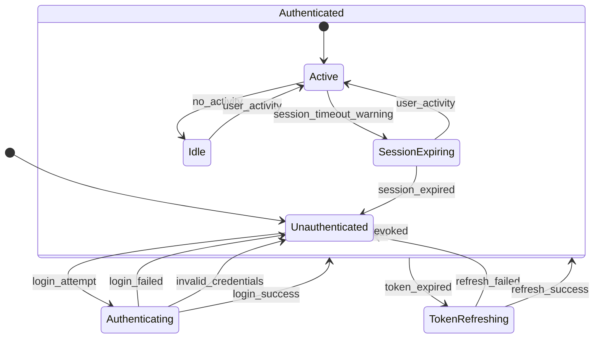
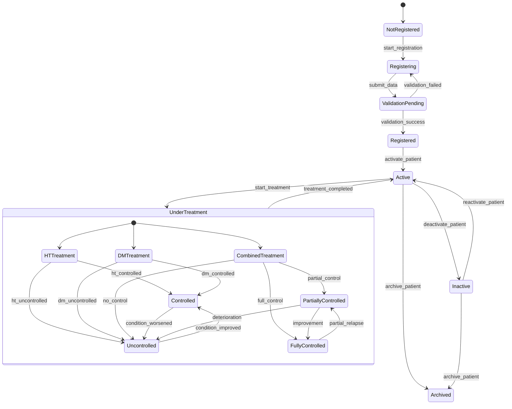
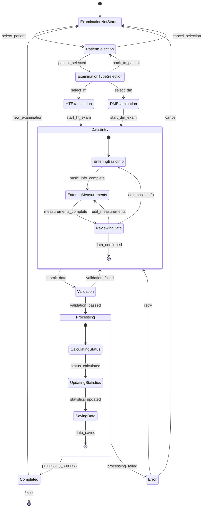
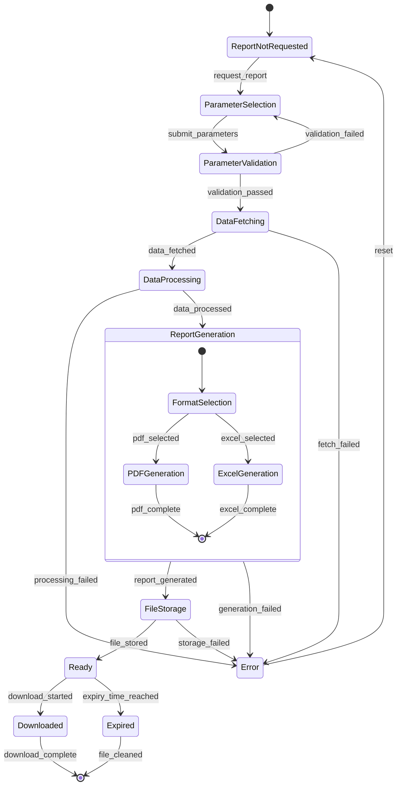
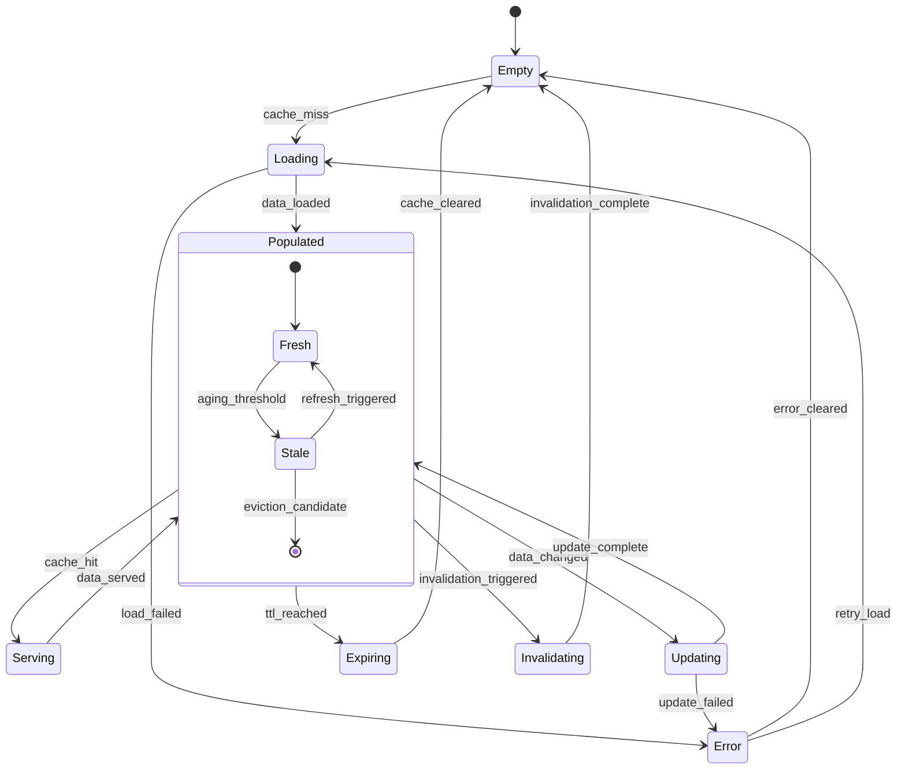
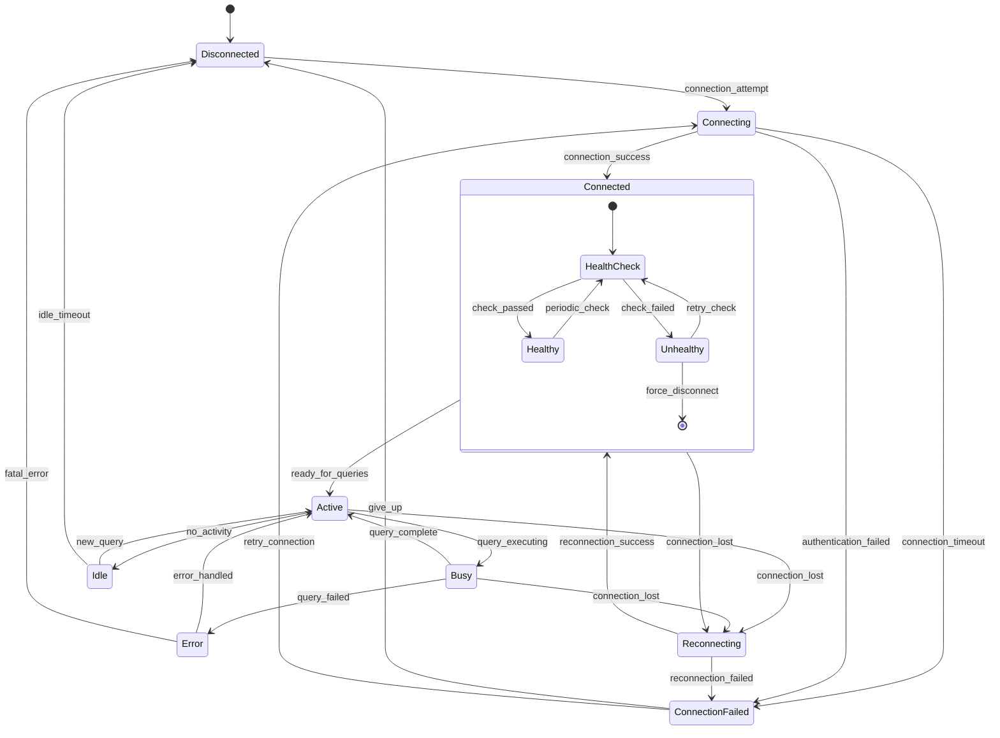
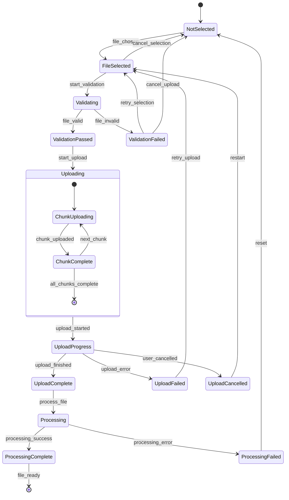
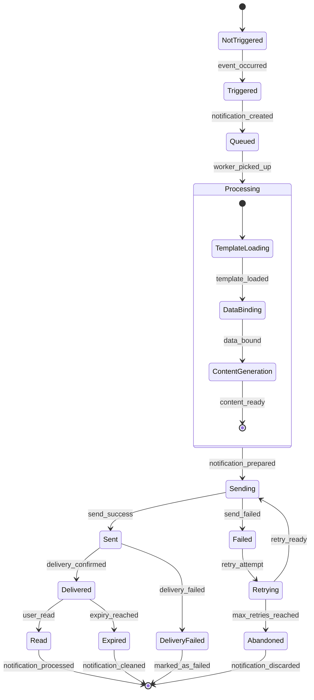
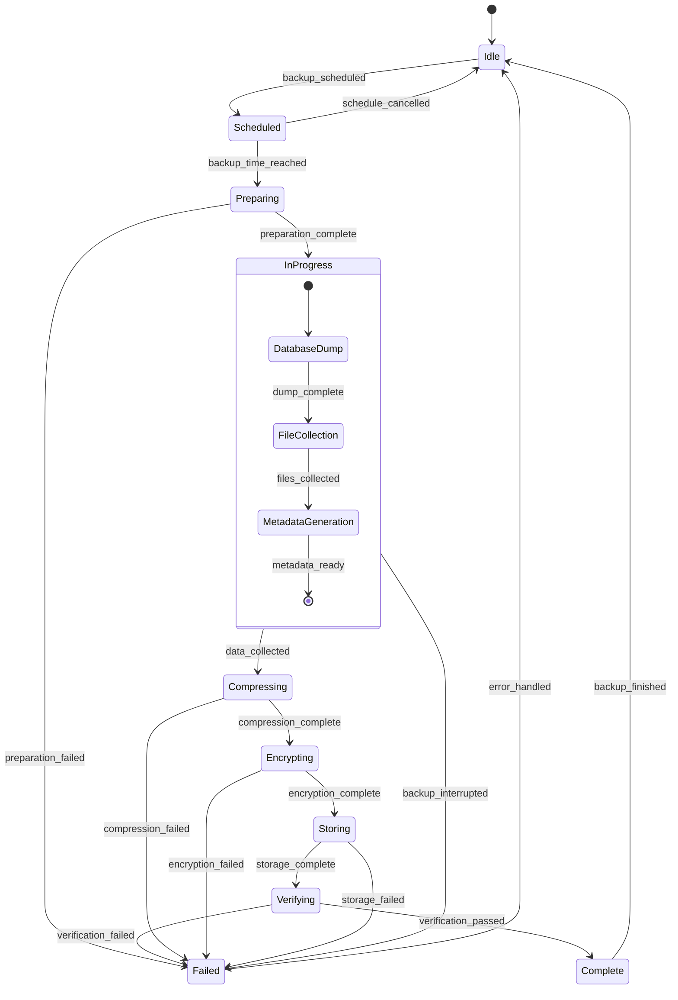

# 🔀 State Diagram

Dokumen ini berisi State Diagram untuk sistem Akudihatinya Backend yang menunjukkan berbagai state dan transisi dalam sistem.

## User Authentication State Diagram

## Patient Management State Diagram

## Examination Process State Diagram

## Report Generation State Diagram

## System Cache State Diagram

## Database Connection State Diagram

## File Upload State Diagram

## Notification State Diagram

## Backup Process State Diagram

## State Transition Rules

### Authentication States
- **Unauthenticated → Authenticating**: User submits login credentials
- **Authenticating → Authenticated**: Credentials validated successfully
- **Authenticated → Unauthenticated**: User logs out or session expires
- **Authenticated → TokenRefreshing**: Access token expires but refresh token is valid

### Patient Management States
- **NotRegistered → Registering**: User starts patient registration process
- **Registered → Active**: Patient record is activated for treatment
- **Active → UnderTreatment**: Patient begins medical treatment
- **UnderTreatment → Controlled/Uncontrolled**: Based on examination results

### Examination Process States
- **ExaminationNotStarted → PatientSelection**: User initiates examination process
- **DataEntry → Validation**: User submits examination data
- **Validation → Processing**: Data passes validation checks
- **Processing → Completed**: Examination data is successfully saved

### Report Generation States
- **ReportNotRequested → ParameterSelection**: User requests a report
- **ParameterValidation → DataFetching**: Parameters are valid
- **ReportGeneration → Ready**: Report file is successfully generated
- **Ready → Downloaded**: User downloads the report

### System Cache States
- **Empty → Loading**: Cache miss triggers data loading
- **Loading → Populated**: Data is successfully loaded into cache
- **Populated → Updating**: Underlying data changes trigger cache update
- **Populated → Expiring**: Cache TTL (Time To Live) is reached

### Error Handling
- Most states have error transitions that lead to appropriate error states
- Error states typically allow for retry operations or reset to initial states
- Critical errors may force the system to disconnect or restart processes

### Concurrency Considerations
- Multiple users can be in different authentication states simultaneously
- Patient states are independent and can change concurrently
- Cache states are shared but managed with proper locking mechanisms
- Database connections are pooled and managed independently