# 🏗️ System Architecture & Design

<p align="center">
  
  
  
</p>

<h3>📊 Comprehensive System Design Documentation</h3>
<p><em>Complete architectural overview including ERD, use cases, state diagrams, data flow, and system diagrams</em></p>

---

## 📋 Table of Contents

1. [Entity Relationship Diagram (ERD)](#entity-relationship-diagram-erd)
2. [Use Case Diagrams](#use-case-diagrams)
3. [System Activity & Sequence Diagrams](#system-activity--sequence-diagrams)
4. [State Diagrams](#state-diagrams)
5. [Data Flow Diagrams](#data-flow-diagrams)
6. [Class & Architecture Diagrams](#class--architecture-diagrams)

---

## 🗄️ Entity Relationship Diagram (ERD)

### Database Schema Overview


---

## 👥 Use Case Diagrams

### Main System Use Case Diagram

```mermaid
graph TB
    %% Actors
    Admin[👤 Admin]
    PuskesmasUser[👤 User Puskesmas]
    System[🖥️ System]
    
    %% Admin Use Cases
    subgraph "Admin Use Cases"
        UC1[Login]
        UC2[Manage Puskesmas]
        UC3[View All Statistics]
        UC4[Export Global Reports]
        UC5[Manage Users]
        UC6[Set Yearly Targets]
        UC7[View System Analytics]
        UC8[Manage System Settings]
    end
    
    %% Puskesmas User Use Cases
    subgraph "Puskesmas User Use Cases"
        UC9[Login]
        UC10[Manage Patients]
        UC11[Record HT Examinations]
        UC12[Record DM Examinations]
        UC13[View Puskesmas Statistics]
        UC14[Export Puskesmas Reports]
        UC15[Update Profile]
        UC16[View Patient History]
        UC17[Archive Old Data]
    end
    
    %% System Use Cases
    subgraph "System Use Cases"
        UC18[Generate Monthly Statistics]
        UC19[Cache Statistics Data]
        UC20[Send Notifications]
        UC21[Backup Data]
        UC22[Clean Archived Data]
    end
    
    %% Relationships
    Admin --> UC1
    Admin --> UC2
    Admin --> UC3
    Admin --> UC4
    Admin --> UC5
    Admin --> UC6
    Admin --> UC7
    Admin --> UC8
    
    PuskesmasUser --> UC9
    PuskesmasUser --> UC10
    PuskesmasUser --> UC11
    PuskesmasUser --> UC12
    PuskesmasUser --> UC13
    PuskesmasUser --> UC14
    PuskesmasUser --> UC15
    PuskesmasUser --> UC16
    PuskesmasUser --> UC17
    
    System --> UC18
    System --> UC19
    System --> UC20
    System --> UC21
    System --> UC22
```



### Account Management Use Case

```mermaid
graph TB
    User[👤 User]
    Admin[👤 Admin]
    
    subgraph "Account Management"
        UC1[Register Account]
        UC2[Login]
        UC3[Logout]
        UC4[Update Profile]
        UC5[Change Password]
        UC6[Reset Password]
        UC7[Manage User Accounts]
        UC8[Assign Roles]
    end
    
    User --> UC1
    User --> UC2
    User --> UC3
    User --> UC4
    User --> UC5
    User --> UC6
    
    Admin --> UC7
    Admin --> UC8
    Admin --> UC2
    Admin --> UC3
    Admin --> UC4
    Admin --> UC5
```



---

## 🔄 System Activity & Sequence Diagrams

### Login Process Activity Diagram


### Record Examination Process Activity Diagram


### API Request Sequence Diagram


---

## 🔀 State Diagrams

### User Authentication State Diagram


### Patient Management State Diagram


### Examination Process State Diagram


---

## 📊 Data Flow Diagrams

### Context Diagram (Level 0)

```mermaid
flowchart TD
    Admin[👤 Admin] 
    PuskesmasUser[👤 Puskesmas User]
    System[🖥️ Akudihatinya System]
    
    Admin -->|Login, Manage Users, View Reports| System
    System -->|Dashboard, Statistics, Reports| Admin
    
    PuskesmasUser -->|Login, Patient Data, Examinations| System
    System -->|Patient Records, Statistics, Reports| PuskesmasUser
```



### Level 1 Data Flow Diagram

```mermaid
flowchart TD
    Admin[👤 Admin]
    PuskesmasUser[👤 Puskesmas User]
    
    subgraph "Akudihatinya System"
        Auth[🔐 Authentication]
        PatientMgmt[👥 Patient Management]
        ExamMgmt[🩺 Examination Management]
        StatsMgmt[📊 Statistics Management]
        ReportMgmt[📋 Report Management]
    end
    
    UserDB[(👥 Users DB)]
    PatientDB[(👤 Patients DB)]
    ExamDB[(🩺 Examinations DB)]
    StatsDB[(📊 Statistics DB)]
    
    Admin --> Auth
    PuskesmasUser --> Auth
    Auth --> UserDB
    
    PuskesmasUser --> PatientMgmt
    PatientMgmt --> PatientDB
    
    PuskesmasUser --> ExamMgmt
    ExamMgmt --> ExamDB
    ExamMgmt --> PatientDB
    
    ExamMgmt --> StatsMgmt
    StatsMgmt --> StatsDB
    
    Admin --> ReportMgmt
    PuskesmasUser --> ReportMgmt
    ReportMgmt --> StatsDB
    ReportMgmt --> ExamDB
    ReportMgmt --> PatientDB
```



### Level 2 Data Flow Diagram - Examination Management


---

## 🏛️ Class & Architecture Diagrams

### System Architecture Overview

```mermaid
graph TB
    subgraph "Frontend Layer"
        WebApp[🌐 Web Application]
        MobileApp[📱 Mobile App]
        API_Client[🔌 API Client]
    end
    
    subgraph "API Gateway"
        Router[🚦 Router]
        Middleware[🛡️ Middleware]
        Auth[🔐 Authentication]
    end
    
    subgraph "Application Layer"
        Controllers[🎮 Controllers]
        Services[⚙️ Services]
        Repositories[📚 Repositories]
    end
    
    subgraph "Domain Layer"
        Models[📋 Models]
        Events[📡 Events]
        Jobs[⚡ Jobs]
    end
    
    subgraph "Infrastructure Layer"
        Database[🗄️ Database]
        Cache[⚡ Cache]
        Storage[💾 File Storage]
        Queue[📬 Queue System]
    end
    
    WebApp --> Router
    MobileApp --> Router
    API_Client --> Router
    
    Router --> Middleware
    Middleware --> Auth
    Auth --> Controllers
    
    Controllers --> Services
    Services --> Repositories
    Services --> Events
    Services --> Jobs
    
    Repositories --> Models
    Models --> Database
    
    Events --> Queue
    Jobs --> Queue
    
    Services --> Cache
    Controllers --> Storage
```



### Core Models Class Diagram

```mermaid
classDiagram
    class User {
        +id: bigint
        +name: string
        +email: string
        +role: enum
        +puskesmas_id: bigint
        +isAdmin(): bool
        +isPuskesmasUser(): bool
        +puskesmas(): BelongsTo
    }
    
    class Puskesmas {
        +id: bigint
        +name: string
        +address: string
        +phone: string
        +email: string
        +users(): HasMany
        +patients(): HasMany
        +htExaminations(): HasMany
        +dmExaminations(): HasMany
        +yearlyTargets(): HasMany
        +monthlyStatistics(): HasMany
    }
    
    class Patient {
        +id: bigint
        +name: string
        +nik: string
        +birth_date: date
        +gender: enum
        +address: string
        +phone: string
        +puskesmas_id: bigint
        +ht_years: json
        +dm_years: json
        +getAge(): int
        +puskesmas(): BelongsTo
        +htExaminations(): HasMany
        +dmExaminations(): HasMany
    }
    
    class HTExamination {
        +id: bigint
        +patient_id: bigint
        +puskesmas_id: bigint
        +systolic: int
        +diastolic: int
        +control_status: enum
        +examination_date: date
        +isControlled(): bool
        +patient(): BelongsTo
        +puskesmas(): BelongsTo
    }
    
    class DMExamination {
        +id: bigint
        +patient_id: bigint
        +puskesmas_id: bigint
        +examination_type: enum
        +result: decimal
        +control_status: enum
        +examination_date: date
        +isControlled(): bool
        +patient(): BelongsTo
        +puskesmas(): BelongsTo
    }
    
    class YearlyTarget {
        +id: bigint
        +puskesmas_id: bigint
        +disease_type: enum
        +year: int
        +target_count: int
        +puskesmas(): BelongsTo
    }
    
    class MonthlyStatistic {
        +id: bigint
        +puskesmas_id: bigint
        +disease_type: enum
        +year: int
        +month: int
        +male_patients: int
        +female_patients: int
        +total_patients: int
        +standard_patients: int
        +non_standard_patients: int
        +achievement_percentage: decimal
        +puskesmas(): BelongsTo
    }
    
    User ||--o{ Puskesmas : belongs_to
    Puskesmas ||--o{ Patient : has_many
    Puskesmas ||--o{ HTExamination : has_many
    Puskesmas ||--o{ DMExamination : has_many
    Puskesmas ||--o{ YearlyTarget : has_many
    Puskesmas ||--o{ MonthlyStatistic : has_many
    
    Patient ||--o{ HTExamination : has_many
    Patient ||--o{ DMExamination : has_many
```

---

## 📝 Architecture Notes

### Design Principles

1. **Separation of Concerns**: Clear separation between controllers, services, and repositories
2. **Single Responsibility**: Each class has a single, well-defined purpose
3. **Dependency Injection**: Services and repositories are injected for better testability
4. **Repository Pattern**: Data access is abstracted through repository interfaces
5. **Service Layer**: Business logic is encapsulated in service classes

### Key Architectural Decisions

- **Laravel Framework**: Provides robust foundation with built-in features
- **RESTful API Design**: Consistent and predictable API endpoints
- **Token-based Authentication**: Stateless authentication using Laravel Sanctum
- **Database Normalization**: Properly normalized database structure
- **Caching Strategy**: Strategic caching for performance optimization
- **Event-driven Architecture**: Events and listeners for decoupled operations

### Performance Considerations

- **Database Indexing**: Proper indexes on frequently queried columns
- **Query Optimization**: Efficient database queries with eager loading
- **Caching**: Redis caching for frequently accessed data
- **API Rate Limiting**: Protection against abuse and overload
- **Background Jobs**: Heavy operations processed asynchronously

---

*This document provides a comprehensive overview of the system architecture and design. For implementation details, refer to the specific feature documentation.*