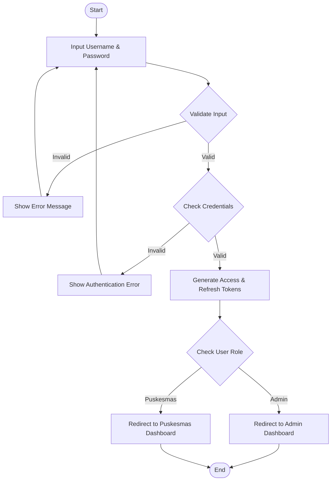
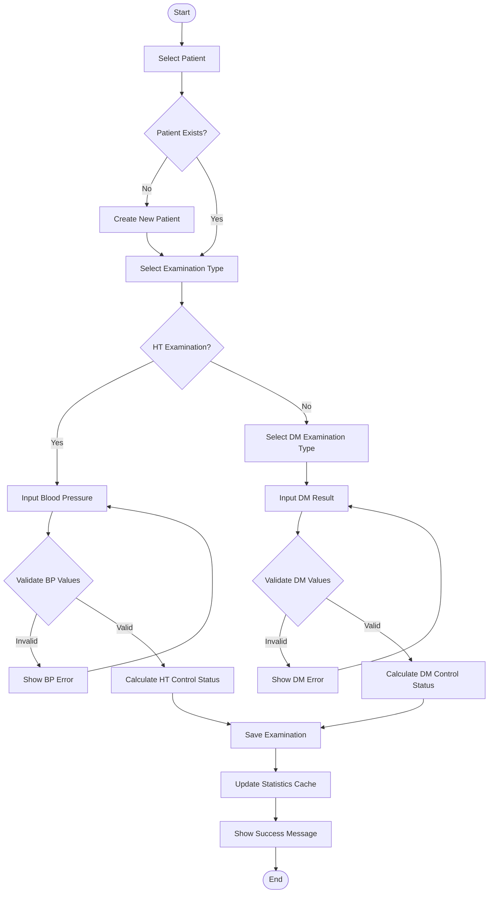
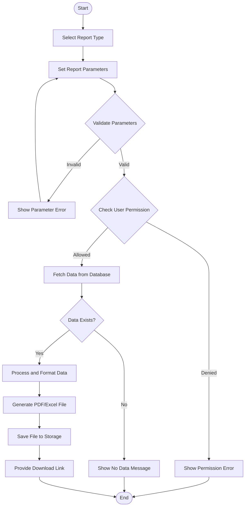
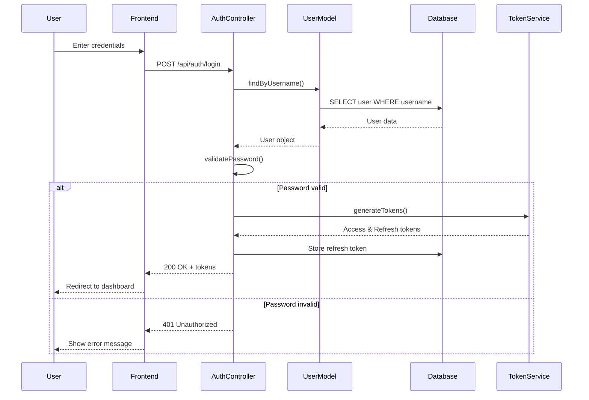
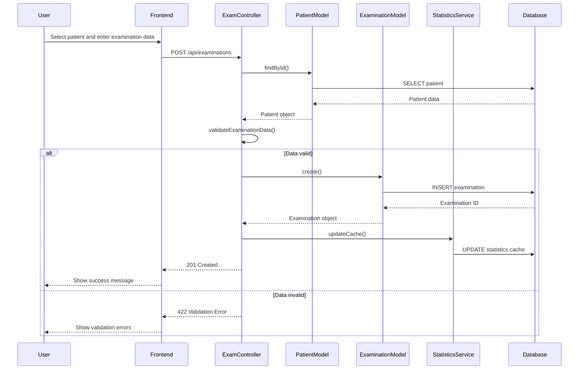
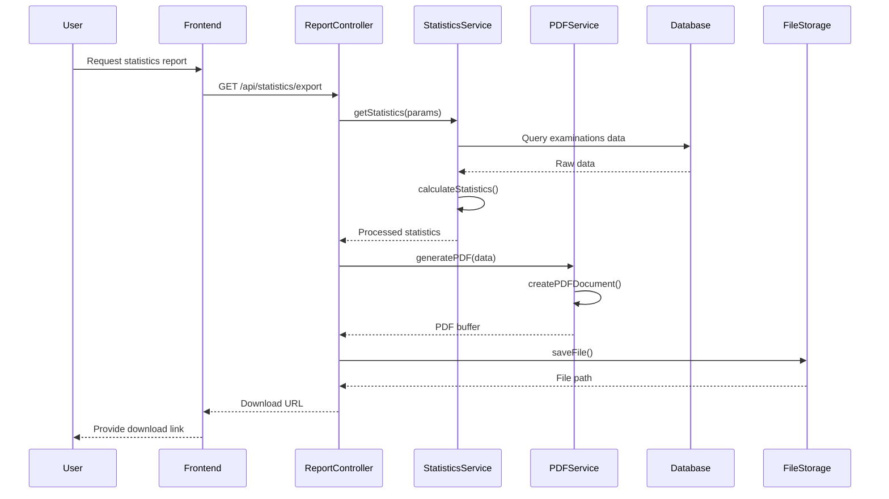
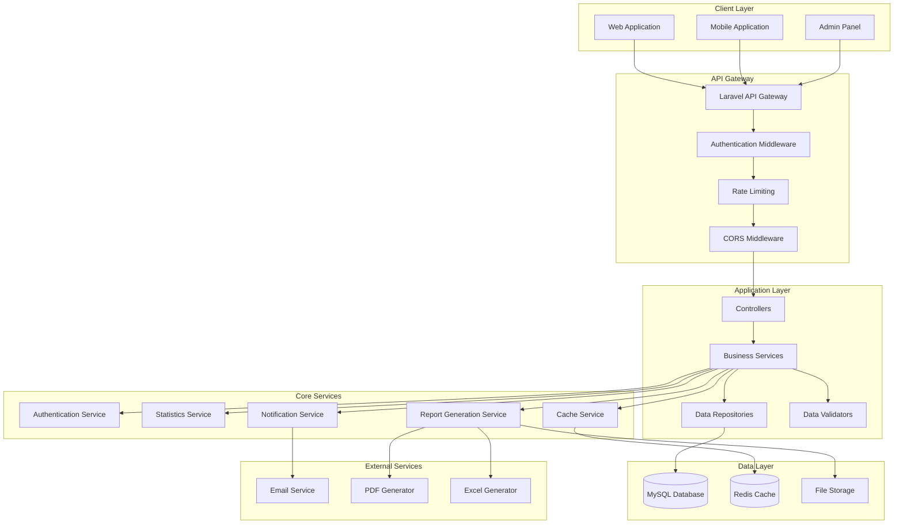
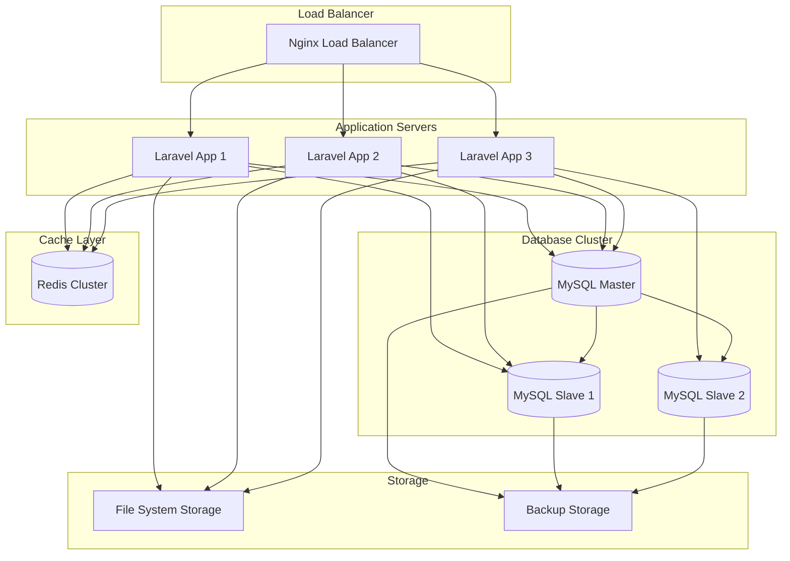
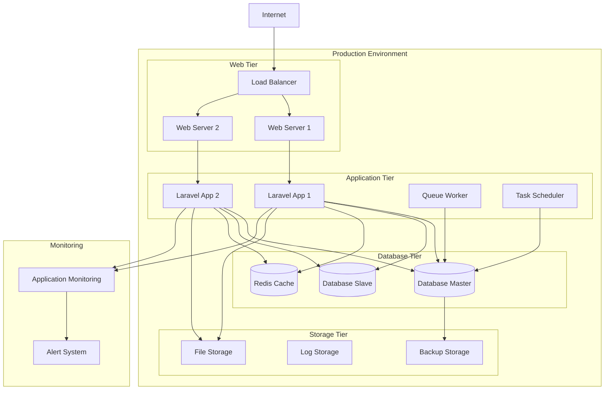
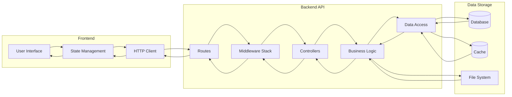

# System Diagrams

Dokumen ini berisi berbagai diagram sistem untuk Akudihatinya Backend meliputi Activity Diagram, Sequence Diagram, Class Diagram, dan Architecture Diagram.

## Activity Diagram

### 1. Activity Diagram - Login Process



### 2. Activity Diagram - Record Examination Process



### 3. Activity Diagram - Generate Report Process



## Sequence Diagram

### 1. Sequence Diagram - Authentication Flow



### 2. Sequence Diagram - Record Examination Flow



### 3. Sequence Diagram - Generate Statistics Report



## Class Diagram

```mermaid
classDiagram
    class User {
        +Long id
        +String username
        +String password
        +String name
        +String profilePicture
        +Role role
        +Long puskesmasId
        +DateTime createdAt
        +DateTime updatedAt
        +validatePassword(String password) Boolean
        +hasRole(Role role) Boolean
        +belongsToPuskesmas(Long puskesmasId) Boolean
    }

    class Puskesmas {
        +Long id
        +String name
        +String address
        +String phone
        +String email
        +Boolean isActive
        +DateTime createdAt
        +DateTime updatedAt
        +activate() void
        +deactivate() void
        +getActiveUsers() List~User~
    }

    class Patient {
        +Long id
        +Long puskesmasId
        +String nik
        +String bpjsNumber
        +String medicalRecordNumber
        +String name
        +String address
        +String phoneNumber
        +Gender gender
        +Date birthDate
        +Integer age
        +List~Integer~ htYears
        +List~Integer~ dmYears
        +DateTime createdAt
        +DateTime updatedAt
        +calculateAge() Integer
        +hasHT() Boolean
        +hasDM() Boolean
        +getLatestHTExamination() HTExamination
        +getLatestDMExamination() DMExamination
    }

    class HTExamination {
        +Long id
        +Long patientId
        +Long puskesmasId
        +Date examinationDate
        +Integer systolic
        +Integer diastolic
        +Integer year
        +Integer month
        +Boolean isArchived
        +DateTime createdAt
        +DateTime updatedAt
        +isControlled() Boolean
        +getBloodPressureCategory() String
        +archive() void
    }

    class DMExamination {
        +Long id
        +Long patientId
        +Long puskesmasId
        +Date examinationDate
        +ExaminationType examinationType
        +Decimal result
        +Integer year
        +Integer month
        +Boolean isArchived
        +DateTime createdAt
        +DateTime updatedAt
        +isControlled() Boolean
        +getControlStatus() String
        +archive() void
    }

    class YearlyTarget {
        +Long id
        +Long puskesmasId
        +DiseaseType diseaseType
        +Integer year
        +Integer targetCount
        +DateTime createdAt
        +DateTime updatedAt
        +calculateAchievement() Double
        +isAchieved() Boolean
    }

    class StatisticsService {
        +calculateHTStatistics(Long puskesmasId, Integer year, Integer month) HTStatistics
        +calculateDMStatistics(Long puskesmasId, Integer year, Integer month) DMStatistics
        +getGlobalStatistics(Integer year, Integer month) GlobalStatistics
        +updateCache(Long puskesmasId, DiseaseType type, Integer year, Integer month) void
        +clearCache(Long puskesmasId) void
    }

    class ReportService {
        +generateHTReport(ReportParams params) Report
        +generateDMReport(ReportParams params) Report
        +generateGlobalReport(ReportParams params) Report
        +exportToPDF(Report report) File
        +exportToExcel(Report report) File
    }

    class AuthService {
        +login(String username, String password) AuthResult
        +logout(String token) void
        +refreshToken(String refreshToken) AuthResult
        +validateToken(String token) Boolean
        +generateTokens(User user) TokenPair
    }

    %% Relationships
    User ||--o{ Puskesmas : belongs_to
    Puskesmas ||--o{ Patient : has_many
    Puskesmas ||--o{ HTExamination : has_many
    Puskesmas ||--o{ DMExamination : has_many
    Puskesmas ||--o{ YearlyTarget : has_many
    Patient ||--o{ HTExamination : has_many
    Patient ||--o{ DMExamination : has_many

    %% Enums
    class Role {
        <<enumeration>>
        ADMIN
        PUSKESMAS
    }

    class Gender {
        <<enumeration>>
        MALE
        FEMALE
    }

    class ExaminationType {
        <<enumeration>>
        HBA1C
        GDP
        GD2JPP
        GDSP
    }

    class DiseaseType {
        <<enumeration>>
        HT
        DM
    }
```

## Architecture Diagram

### 1. System Architecture Overview



### 2. Database Architecture



## Deployment Diagram



## Component Interaction Flow

