# Use Case Diagram

Dokumen ini berisi Use Case Diagram lengkap untuk sistem Akudihatinya Backend.

## Use Case Diagram Utama

```mermaid
graph TB
    %% Actors
    Admin[👤 Admin]
    PuskesmasUser[👤 User Puskesmas]
    System[🖥️ System]
    
    %% Admin Use Cases
    subgraph "Admin Use Cases"
        UC1[Login]
        UC2[Manage Puskesmas]
        UC3[View All Statistics]
        UC4[Export Global Reports]
        UC5[Manage Users]
        UC6[Set Yearly Targets]
        UC7[View System Analytics]
        UC8[Manage System Settings]
    end
    
    %% Puskesmas User Use Cases
    subgraph "Puskesmas User Use Cases"
        UC9[Login]
        UC10[Manage Patients]
        UC11[Record HT Examinations]
        UC12[Record DM Examinations]
        UC13[View Puskesmas Statistics]
        UC14[Export Puskesmas Reports]
        UC15[Update Profile]
        UC16[View Patient History]
        UC17[Archive Old Data]
    end
    
    %% System Use Cases
    subgraph "System Use Cases"
        UC18[Generate Monthly Statistics]
        UC19[Cache Statistics Data]
        UC20[Send Notifications]
        UC21[Backup Data]
        UC22[Clean Archived Data]
    end
    
    %% Relationships
    Admin --> UC1
    Admin --> UC2
    Admin --> UC3
    Admin --> UC4
    Admin --> UC5
    Admin --> UC6
    Admin --> UC7
    Admin --> UC8
    
    PuskesmasUser --> UC9
    PuskesmasUser --> UC10
    PuskesmasUser --> UC11
    PuskesmasUser --> UC12
    PuskesmasUser --> UC13
    PuskesmasUser --> UC14
    PuskesmasUser --> UC15
    PuskesmasUser --> UC16
    PuskesmasUser --> UC17
    
    System --> UC18
    System --> UC19
    System --> UC20
    System --> UC21
    System --> UC22
```

## Detail Use Cases

### 1. Authentication Use Cases

#### UC1 & UC9: Login
**Actor:** Admin, User Puskesmas  
**Deskripsi:** Pengguna melakukan autentikasi untuk mengakses sistem  
**Precondition:** Pengguna memiliki akun yang valid  
**Flow:**
1. Pengguna memasukkan username dan password
2. Sistem memvalidasi kredensial
3. Sistem menghasilkan access token dan refresh token
4. Pengguna diarahkan ke dashboard sesuai role

**Postcondition:** Pengguna berhasil login dan dapat mengakses fitur sesuai role

### 2. Admin Use Cases

#### UC2: Manage Puskesmas
**Actor:** Admin  
**Deskripsi:** Admin mengelola data puskesmas  
**Flow:**
1. Admin mengakses halaman manajemen puskesmas
2. Admin dapat menambah, mengubah, atau menonaktifkan puskesmas
3. Sistem menyimpan perubahan data puskesmas

#### UC3: View All Statistics
**Actor:** Admin  
**Deskripsi:** Admin melihat statistik dari semua puskesmas  
**Flow:**
1. Admin mengakses dashboard statistik global
2. Sistem menampilkan agregasi data dari semua puskesmas
3. Admin dapat memfilter berdasarkan periode, jenis penyakit, atau puskesmas

#### UC4: Export Global Reports
**Actor:** Admin  
**Deskripsi:** Admin mengekspor laporan global dalam format PDF/Excel  
**Flow:**
1. Admin memilih parameter laporan (periode, format, filter)
2. Sistem menghasilkan laporan sesuai parameter
3. Sistem menyediakan file untuk diunduh

#### UC5: Manage Users
**Actor:** Admin  
**Deskripsi:** Admin mengelola akun pengguna puskesmas  
**Flow:**
1. Admin mengakses halaman manajemen pengguna
2. Admin dapat menambah, mengubah, atau menonaktifkan pengguna
3. Admin mengatur role dan akses pengguna

#### UC6: Set Yearly Targets
**Actor:** Admin  
**Deskripsi:** Admin menetapkan target tahunan untuk setiap puskesmas  
**Flow:**
1. Admin mengakses halaman target tahunan
2. Admin menetapkan target untuk HT dan DM per puskesmas
3. Sistem menyimpan target dan menggunakannya untuk evaluasi

#### UC7: View System Analytics
**Actor:** Admin  
**Deskripsi:** Admin melihat analitik penggunaan sistem  
**Flow:**
1. Admin mengakses dashboard analitik sistem
2. Sistem menampilkan metrik penggunaan, performa, dan tren

#### UC8: Manage System Settings
**Actor:** Admin  
**Deskripsi:** Admin mengelola pengaturan sistem global  
**Flow:**
1. Admin mengakses halaman pengaturan sistem
2. Admin mengubah konfigurasi sistem
3. Sistem menerapkan perubahan konfigurasi

### 3. Puskesmas User Use Cases

#### UC10: Manage Patients
**Actor:** User Puskesmas  
**Deskripsi:** User mengelola data pasien di puskesmasnya  
**Flow:**
1. User mengakses halaman manajemen pasien
2. User dapat menambah, mengubah, atau melihat data pasien
3. Sistem menyimpan data pasien dengan validasi NIK

#### UC11: Record HT Examinations
**Actor:** User Puskesmas  
**Deskripsi:** User mencatat hasil pemeriksaan hipertensi  
**Flow:**
1. User memilih pasien untuk pemeriksaan
2. User memasukkan data tekanan darah (sistolik/diastolik)
3. Sistem menghitung status kontrol berdasarkan nilai normal
4. Sistem menyimpan data pemeriksaan

#### UC12: Record DM Examinations
**Actor:** User Puskesmas  
**Deskripsi:** User mencatat hasil pemeriksaan diabetes mellitus  
**Flow:**
1. User memilih pasien untuk pemeriksaan
2. User memilih jenis pemeriksaan (HbA1c, GDP, GD2JPP, GDSP)
3. User memasukkan hasil pemeriksaan
4. Sistem menghitung status kontrol berdasarkan jenis pemeriksaan
5. Sistem menyimpan data pemeriksaan

#### UC13: View Puskesmas Statistics
**Actor:** User Puskesmas  
**Deskripsi:** User melihat statistik puskesmasnya  
**Flow:**
1. User mengakses dashboard statistik puskesmas
2. Sistem menampilkan statistik HT dan DM untuk puskesmas tersebut
3. User dapat memfilter berdasarkan periode

#### UC14: Export Puskesmas Reports
**Actor:** User Puskesmas  
**Deskripsi:** User mengekspor laporan puskesmasnya  
**Flow:**
1. User memilih parameter laporan (periode, format, jenis penyakit)
2. Sistem menghasilkan laporan khusus puskesmas
3. Sistem menyediakan file untuk diunduh

#### UC15: Update Profile
**Actor:** User Puskesmas  
**Deskripsi:** User mengubah profil dan informasi akunnya  
**Flow:**
1. User mengakses halaman profil
2. User mengubah informasi profil (nama, foto, dll)
3. Sistem menyimpan perubahan profil

#### UC16: View Patient History
**Actor:** User Puskesmas  
**Deskripsi:** User melihat riwayat pemeriksaan pasien  
**Flow:**
1. User memilih pasien
2. Sistem menampilkan riwayat pemeriksaan HT dan DM
3. User dapat melihat tren dan perkembangan kondisi pasien

#### UC17: Archive Old Data
**Actor:** User Puskesmas  
**Deskripsi:** User mengarsipkan data pemeriksaan lama  
**Flow:**
1. User mengakses halaman manajemen data
2. User memilih data yang akan diarsipkan
3. Sistem memindahkan data ke status arsip

### 4. System Use Cases

#### UC18: Generate Monthly Statistics
**Actor:** System  
**Deskripsi:** Sistem otomatis menghasilkan statistik bulanan  
**Flow:**
1. Sistem berjalan secara terjadwal setiap akhir bulan
2. Sistem menghitung statistik untuk semua puskesmas
3. Sistem menyimpan hasil ke cache untuk performa

#### UC19: Cache Statistics Data
**Actor:** System  
**Deskripsi:** Sistem menyimpan data statistik ke cache  
**Flow:**
1. Sistem mendeteksi permintaan statistik yang sering diakses
2. Sistem menyimpan hasil perhitungan ke cache
3. Sistem menggunakan cache untuk permintaan selanjutnya

#### UC20: Send Notifications
**Actor:** System  
**Deskripsi:** Sistem mengirim notifikasi otomatis  
**Flow:**
1. Sistem mendeteksi event yang memerlukan notifikasi
2. Sistem menghasilkan pesan notifikasi
3. Sistem mengirim notifikasi ke pengguna terkait

#### UC21: Backup Data
**Actor:** System  
**Deskripsi:** Sistem melakukan backup data secara otomatis  
**Flow:**
1. Sistem berjalan secara terjadwal
2. Sistem membuat backup database
3. Sistem menyimpan backup ke lokasi aman

#### UC22: Clean Archived Data
**Actor:** System  
**Deskripsi:** Sistem membersihkan data arsip lama  
**Flow:**
1. Sistem berjalan secara terjadwal
2. Sistem mengidentifikasi data arsip yang sudah sangat lama
3. Sistem menghapus data sesuai kebijakan retensi

## Use Case Relationships

### Include Relationships
- UC11, UC12 include "Validate Patient Data"
- UC4, UC14 include "Generate Report"
- UC3, UC13 include "Calculate Statistics"

### Extend Relationships
- UC10 extends "Send Patient Notification"
- UC11, UC12 extend "Update Patient Status"
- UC6 extends "Send Target Notification"

### Generalization
- UC1 dan UC9 adalah generalisasi dari "Authentication"
- UC4 dan UC14 adalah generalisasi dari "Export Report"

## Business Rules

1. **Role-based Access Control:**
   - Admin dapat mengakses semua data
   - User Puskesmas hanya dapat mengakses data puskesmasnya

2. **Data Validation:**
   - NIK pasien harus unik
   - Tanggal pemeriksaan tidak boleh di masa depan
   - Nilai pemeriksaan harus dalam rentang yang valid

3. **Audit Trail:**
   - Semua perubahan data dicatat dengan timestamp
   - Data pemeriksaan tidak dapat dihapus, hanya diarsipkan

4. **Performance:**
   - Statistik bulanan di-cache untuk performa
   - Data arsip dipisahkan untuk optimasi query

5. **Security:**
   - Semua endpoint memerlukan autentikasi
   - Token memiliki masa berlaku terbatas
   - Password di-hash dengan algoritma yang aman

## Entity Relationship Diagram (ERD)

## Penjelasan Entitas

### 1. USERS
- Menyimpan data pengguna sistem (Admin dan Puskesmas)
- Role: admin (dapat mengakses semua data) atau puskesmas (hanya data puskesmas sendiri)
- Berelasi dengan PUSKESMAS untuk user dengan role puskesmas

### 2. PUSKESMAS
- Master data puskesmas
- Memiliki relasi one-to-many dengan hampir semua entitas lain
- Field is_active untuk mengaktifkan/menonaktifkan puskesmas

### 3. PATIENTS
- Data pasien yang terdaftar di puskesmas
- Menyimpan riwayat tahun menderita HT dan DM dalam format JSON
- NIK sebagai unique identifier

### 4. HT_EXAMINATIONS
- Data pemeriksaan hipertensi
- Menyimpan tekanan darah sistolik dan diastolik
- Memiliki field is_archived untuk arsip data

### 5. DM_EXAMINATIONS
- Data pemeriksaan diabetes mellitus
- Support multiple jenis pemeriksaan (HbA1c, GDP, GD2JPP, GDSP)
- Hasil pemeriksaan disimpan sebagai decimal

### 6. YEARLY_TARGETS
- Target tahunan untuk setiap puskesmas per jenis penyakit
- Digunakan untuk perhitungan pencapaian target

### 7. USER_REFRESH_TOKENS
- Token refresh untuk autentikasi
- Memiliki expiry time

### 8. MONTHLY_STATISTICS_CACHE
- Cache untuk statistik bulanan
- Menyimpan data dalam format JSON untuk performa yang lebih baik
